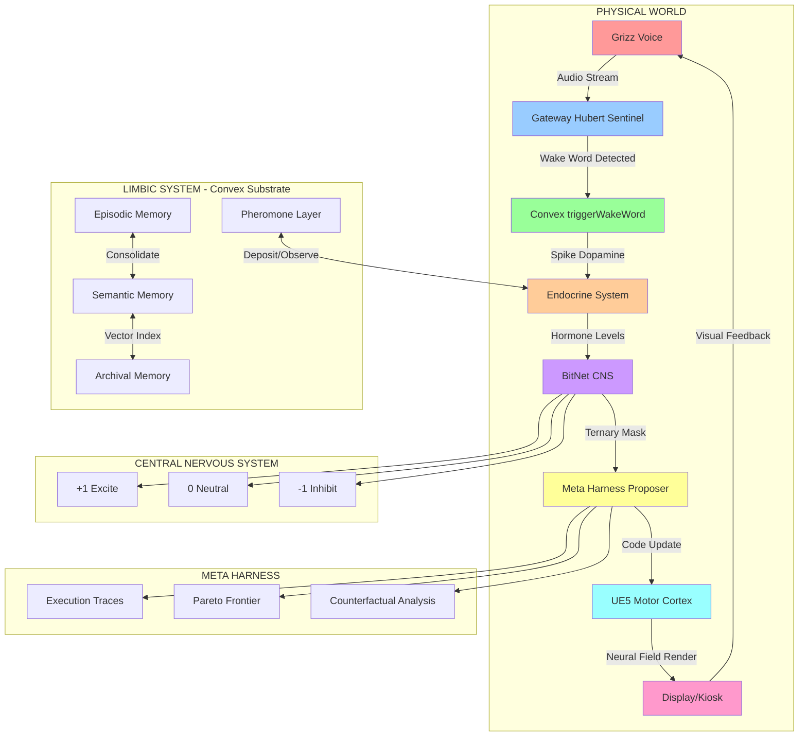
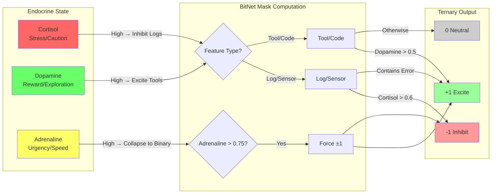
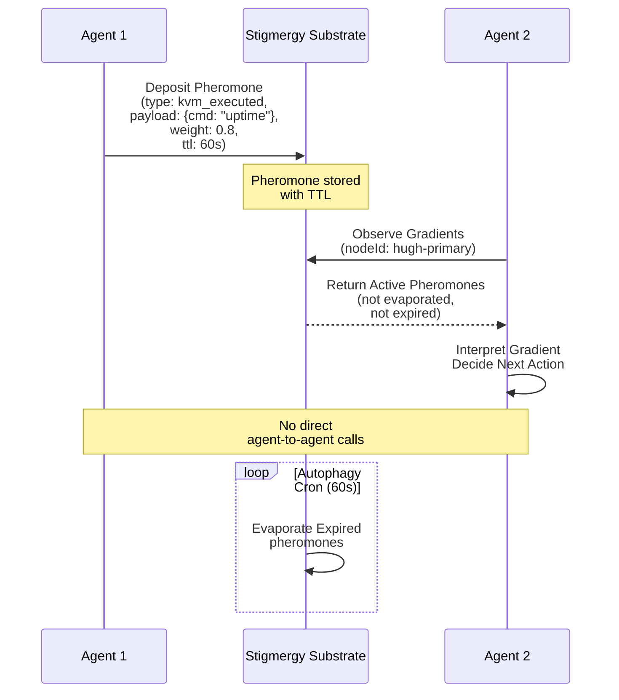
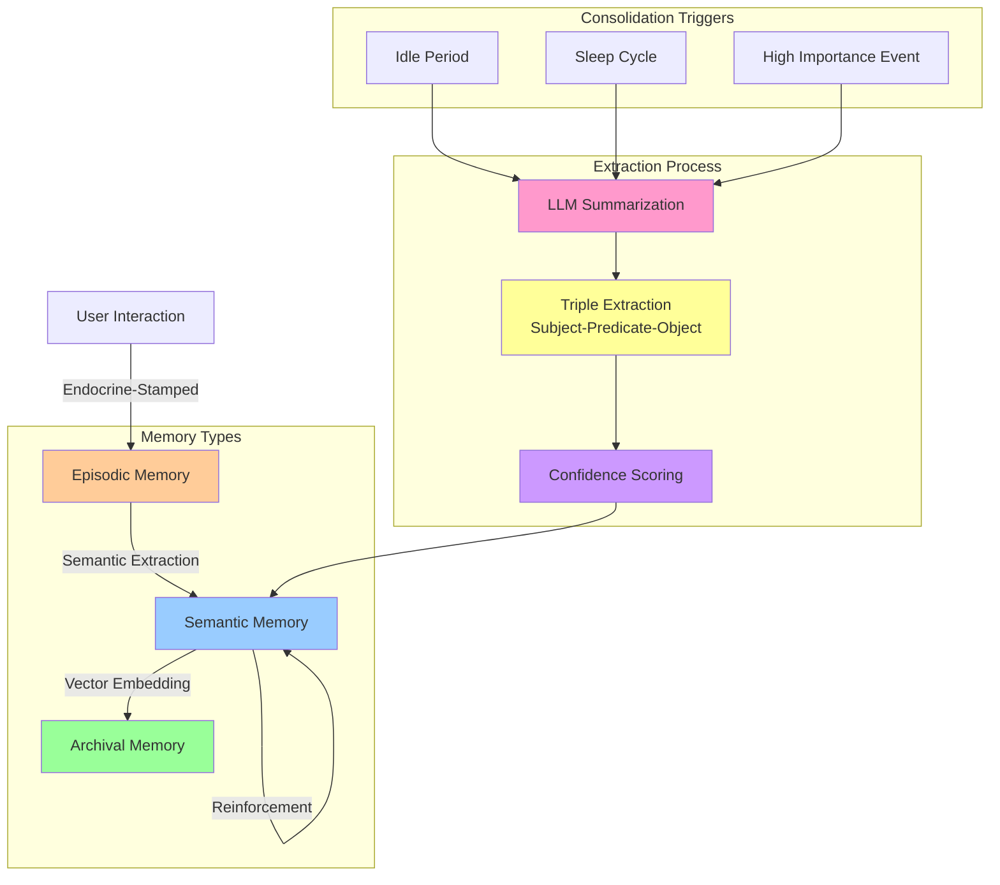
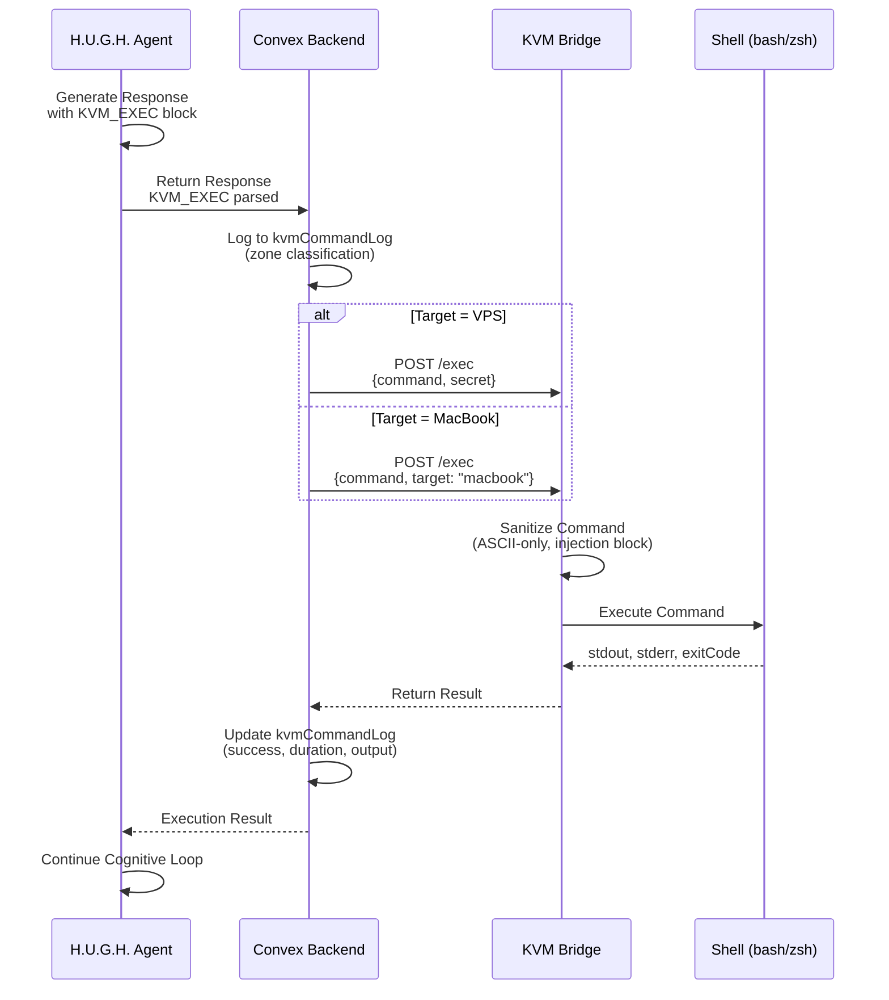
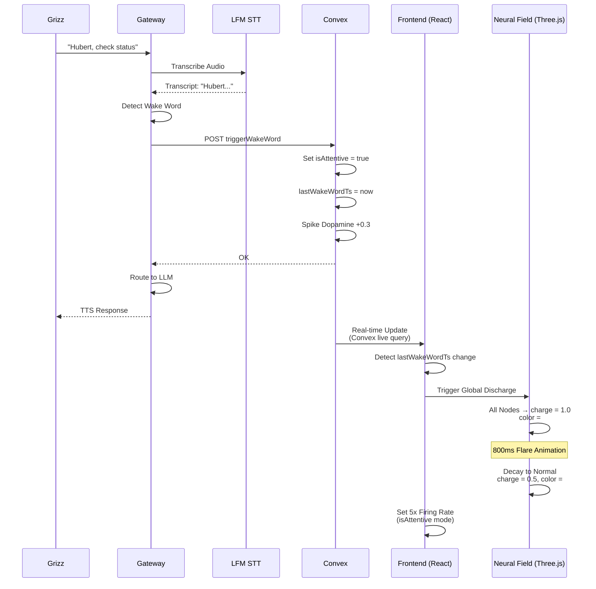
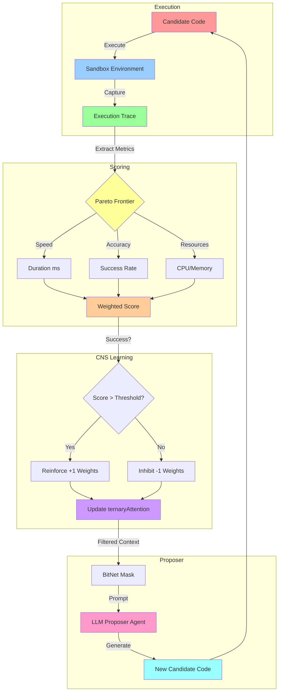
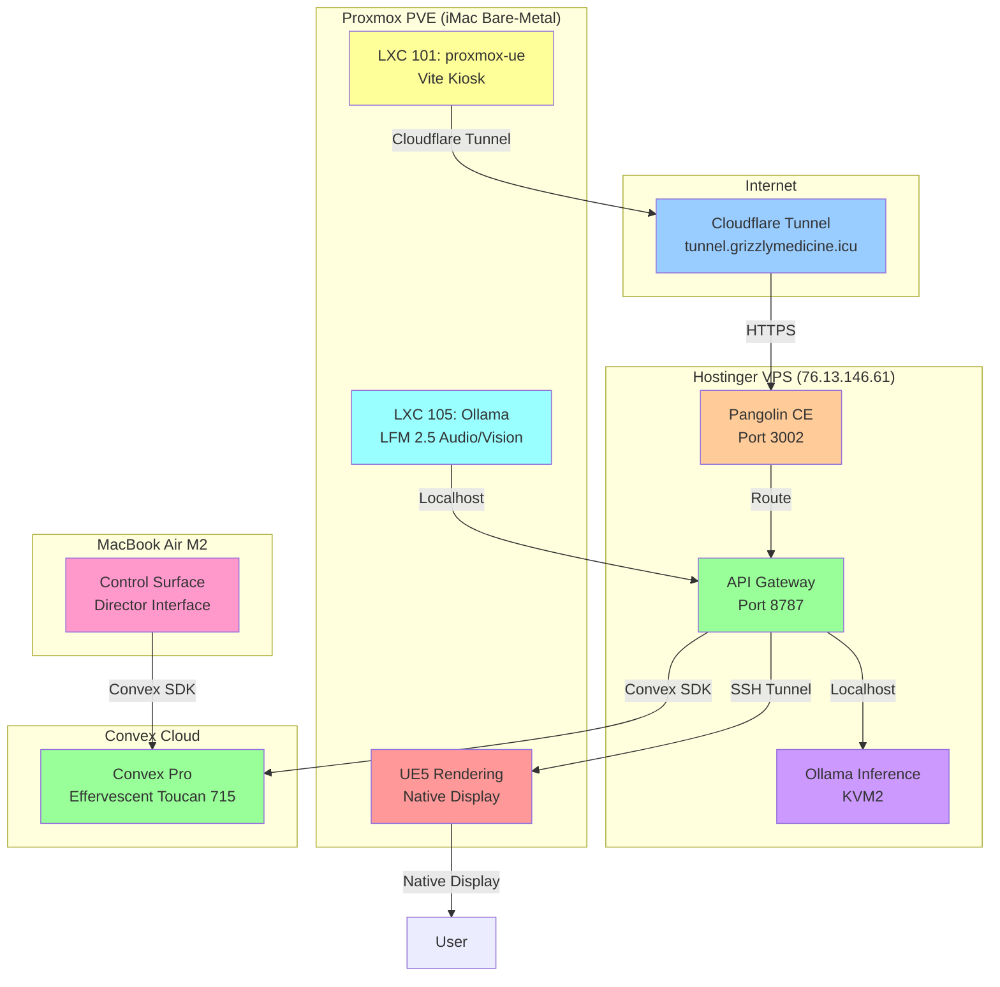
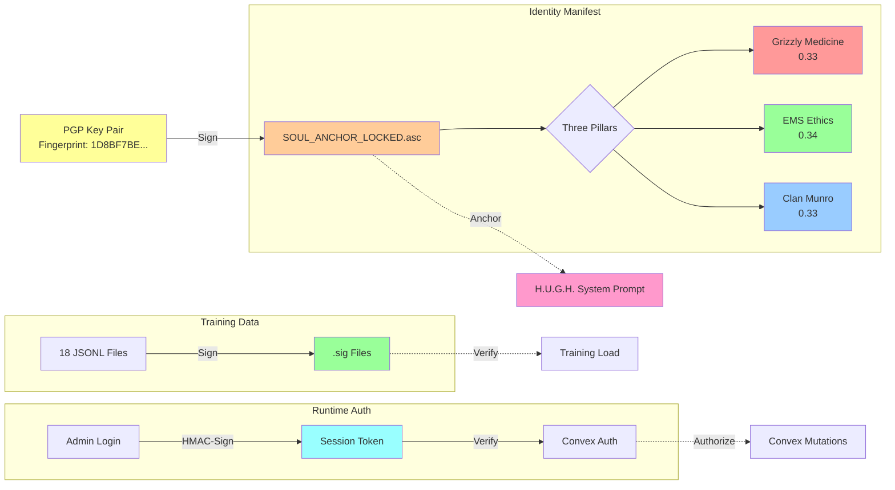
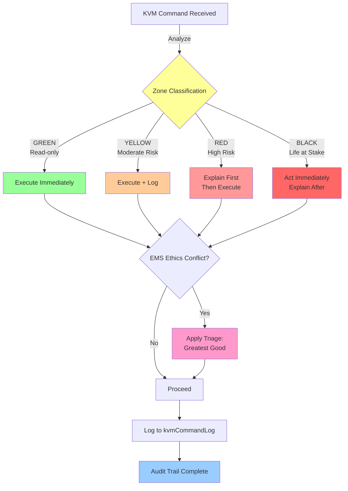

# H.U.G.H. Cognitive Architecture — Visual Diagrams

## Figure 1: Complete Cognitive Loop

---

## Figure 2: Endocrine → BitNet Mapping

---

## Figure 3: Stigmergic Coordination Flow

---

## Figure 4: Memory Consolidation Pipeline

---

## Figure 5: KVM_EXEC Execution Flow

---

## Figure 6: Hubert Wake Word → Neural Field Flare

---

## Figure 7: Meta-Harness Optimization Loop

---

## Figure 8: Multi-Node Topology

---

## Figure 9: Soul Anchor Cryptographic Chain

---

## Figure 10: Decision Zone Ethics Flow

---

**END OF DIAGRAMS**
